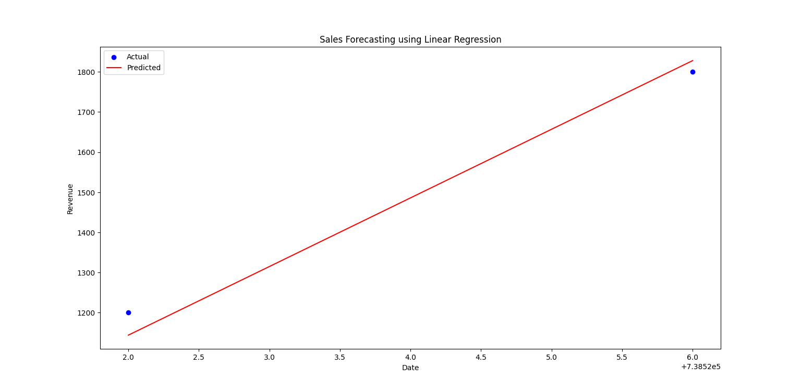

# Project 1: Sales Forecasting using Linear Regression

## Objective
Predict future sales revenue using past sales data.

## Tools Used
- Python
- pandas
- matplotlib
- scikit-learn

## Dataset
- Columns: Date, Product, Quantity, Revenue
- Sample of 8 days

## Method
1. Load and clean data
2. Convert date to numeric
3. Apply Linear Regression
4. Plot results

## Output
Graph comparing actual and predicted sales revenue.

## Screenshot

## Author
Suparna Chaudhari
